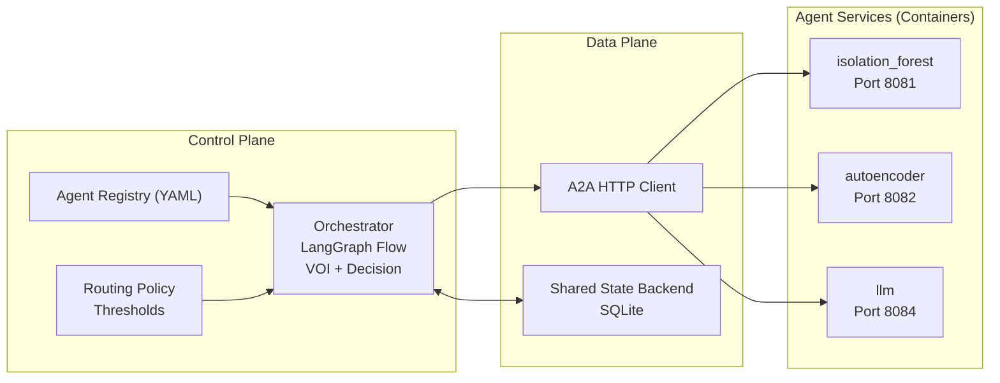

# BAO (Bayesian Agent Orchestrator)

Containerized multi-agent orchestrator with a lightweight Bayesian control layer, VOI routing, and a shared state backend. Agents run as independent HTTP services; the orchestrator connects to them via a registry in `config/agents.yaml`.

**Key traits**
- Control plane vs data plane split
- Registry-driven agent discovery (YAML)
- A2A HTTP+JSON contract for inference/health/capabilities
- Shared state backend (SQLite) keyed by `agent_id`
- Lightweight Bayesian updates and surrogate VOI in hot path

**Architecture diagram**



## Quickstart

### 1) Train models (optional - models can be pre-built)
```bash
make train
```

### 2) Build and start agents
```bash
make build
make up
```

### 3) Run orchestrator replay
Requires a labeled dataset with a `label` column.

```bash
python3 main.py \
  --dataset /path/to/replay.csv \
  --config config/orchestrator_config.json \
  --max-flows 1000
```

### 4) Check agent health
```bash
make health
```

### 5) Stop agents
```bash
make down
```

## Agents

| Agent | Port | Model | Description |
|-------|------|-------|-------------|
| `isolation_forest` | 8081 | sklearn IsolationForest | Lightweight anomaly detector |
| `autoencoder` | 8082 | PyTorch Autoencoder | Deep reconstruction-based detector |
| `llm` | 8084 | Ollama/qwen3 | LLM-based semantic triage |

## A2A HTTP Contract

**Inference** `POST /a2a/infer`

```json
{
  "request_id": "uuid",
  "flow_id": "string",
  "timestamp": 0.0,
  "flow_features": {},
  "context": {
    "belief": {"p_mal": 0.5, "uncertainty": 0.69},
    "requested_capabilities": []
  }
}
```

**Response**

```json
{
  "agent_id": "isolation_forest",
  "proba": [0.7, 0.3],
  "prediction": {"label": "benign", "probability": 0.3},
  "uncertainty": {"epistemic": 0.1, "aleatoric": 0.2, "total_entropy": 0.3},
  "cost": 1.0,
  "latency_ms": 12.0,
  "metadata": {}
}
```

**Health** `GET /a2a/health` -> `{"status":"ok","agent_id":"...","version":"..."}`

**Capabilities** `GET /a2a/capabilities` -> `{"agent_id":"...","capabilities":[...],"cost":...}`

## Configuration

- `config/agents.yaml`: registry for containerized agents
- `config/orchestrator_config.json`: orchestration thresholds/costs/replay/voi flags

## Project layout

```
.
├── main.py                          # Entry point for replay
├── Makefile                         # Build/run commands
├── docker-compose.agents.yml        # Agent containers
├── config/
│   ├── agents.yaml                  # Agent registry
│   └── orchestrator_config.json     # Orchestrator config
├── orchestrator/
│   ├── integrated_system.py         # Orchestrator runtime
│   ├── control/                     # Policy, registry, scheduler
│   └── data_plane/                  # A2A client, state backend
└── agents/
    ├── isolation_forest/service.py  # IsolationForest agent
    ├── autoencoder/service.py       # Autoencoder agent
    └── llm/service.py               # LLM agent
```

## Notes
- All inference is via A2A HTTP - agents are black boxes
- Lightweight Bayesian updates are used in the hot path; exact VOI is off by default
