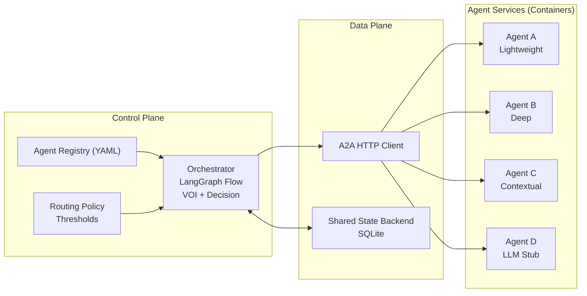

# BAO (Bayesian Agent Orchestrator)

Remote-first, containerized multi-agent orchestrator with a lightweight Bayesian control layer, VOI routing, and a shared state backend. All agents (A/B/C/D) run as independent HTTP services; the orchestrator connects to them via a registry in `config/agents.yaml`.

**Key traits**
- Control plane vs data plane split
- Registry-driven agent discovery (YAML)
- A2A HTTP+JSON contract for inference/health/capabilities
- Shared state backend (SQLite) keyed by `agent_id`
- Lightweight Bayesian updates and surrogate VOI in hot path

**Architecture diagram**



## Quickstart

### 1) Run agents locally (no Docker)
Starts four HTTP services on `127.0.0.1:8081-8084` using `config/agents.local.yaml`.

```bash
python3 /Users/jasonwvh/Documents/projects/bao/scripts/run_local.py --startup-only
```

### 2) Run orchestrator replay against local agents
Requires a labeled dataset with a `label` column.

```bash
python3 /Users/jasonwvh/Documents/projects/bao/scripts/run_replay.py \
  --dataset /path/to/replay.csv \
  --config /Users/jasonwvh/Documents/projects/bao/config/bao_config.json \
  --max-flows 1000
```

### 3) Run agents with Docker Compose

```bash
docker compose -f /Users/jasonwvh/Documents/projects/bao/docker-compose.agents.yml up --build
```

Orchestrator reads `config/agents.yaml` by default (container DNS names).

## What is `run_replay`?
`/Users/jasonwvh/Documents/projects/bao/scripts/run_replay.py` is the offline evaluation runner. It:
- loads a labeled replay dataset (CSV or Parquet)
- replays flows in temporal order
- invokes the orchestrator for each flow
- writes JSONL artifacts under `/Users/jasonwvh/Documents/projects/bao/artifacts/replay/`

## A2A HTTP Contract

**Inference** `POST /a2a/infer`

```json
{
  "request_id": "uuid",
  "flow_id": "string",
  "timestamp": 0.0,
  "flow_features": {},
  "context": {
    "belief": {"p_mal": 0.5, "uncertainty": 0.69},
    "requested_capabilities": []
  }
}
```

**Response**

```json
{
  "agent_id": "agent_a",
  "proba": [0.7, 0.3],
  "prediction": {"label": "benign", "probability": 0.3},
  "uncertainty": {"epistemic": 0.1, "aleatoric": 0.2, "total_entropy": 0.3},
  "cost": 1.0,
  "latency_ms": 12.0,
  "metadata": {}
}
```

**Health** `GET /a2a/health` -> `{"status":"ok","agent_id":"...","version":"..."}`

**Capabilities** `GET /a2a/capabilities` -> `{"agent_id":"...","capabilities":[...],"cost":...}`

## Configuration

- `/Users/jasonwvh/Documents/projects/bao/config/agents.yaml`: registry for containerized agents
- `/Users/jasonwvh/Documents/projects/bao/config/agents.local.yaml`: registry for local dev services
- `/Users/jasonwvh/Documents/projects/bao/config/bao_config.json`: orchestration thresholds/costs/replay/voi flags

## Project layout (selected)

- `/Users/jasonwvh/Documents/projects/bao/bao/integrated_system.py`: orchestrator runtime
- `/Users/jasonwvh/Documents/projects/bao/bao/control/registry.py`: registry loading and validation
- `/Users/jasonwvh/Documents/projects/bao/bao/data_plane/a2a_client.py`: A2A HTTP client
- `/Users/jasonwvh/Documents/projects/bao/bao/data_plane/state_sqlite.py`: shared SQLite state
- `/Users/jasonwvh/Documents/projects/bao/agents/*/service.py`: A2A agent services
- `/Users/jasonwvh/Documents/projects/bao/bao/benchmark/`: benchmark harness

## Tests

```bash
python3 -m pytest -q
```

## Notes
- No local in-process inference path remains. All inference is via A2A HTTP.
- Lightweight Bayesian updates are used in the hot path; exact VOI is off by default.
- Benchmark harness is preserved and can be run separately from runtime replay.
