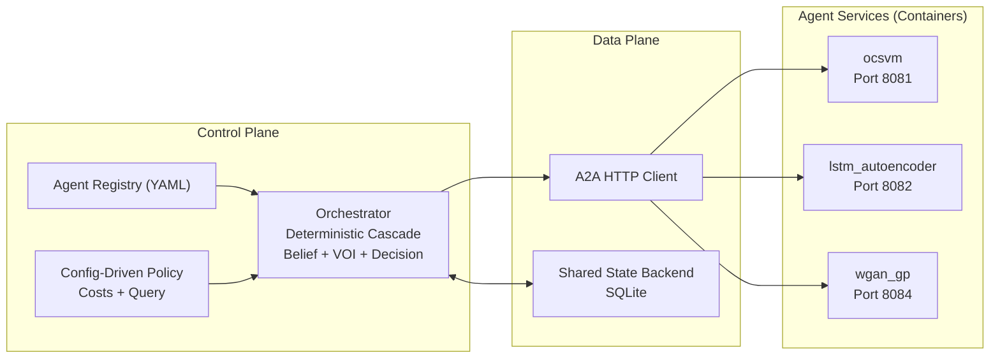

# BAO (Bayesian Agent Orchestrator)

Containerized multi-agent orchestrator with a deterministic Bayesian cascade controller, VOI-based query gating, and a shared SQLite state backend. Agents run as independent HTTP services; the orchestrator connects to them via a registry in `config/agents.yaml`.

**Key traits**
- Control plane vs data plane split
- Registry-driven agent discovery (YAML)
- A2A HTTP+JSON contract for inference/health/capabilities
- Shared state backend (SQLite) keyed by `agent_id`
- Posterior-first belief updates with optional strict-likelihood mode
- Expected-cost action selection (`accept` / `reject` / `defer`)
- Adaptive utility router (dynamic cheapest-first + expected-gain + utilization-band exploration)
- Approximate VOI query gating for strict-cascade mode
- Dual runtime support: deterministic default, optional LangGraph parity runtime
- Split semantics: `decision` (classification) and `action_decision` (utility action)

**Architecture diagram**


```mermaid
flowchart LR
  subgraph ControlPlane["Control Plane"]
    REG["Agent Registry (YAML)"]
    ORCH["Orchestrator\nDeterministic Cascade\nBelief + VOI + Decision"]
    POL["Config-Driven Policy\nCosts + Query"]
  end

  subgraph DataPlane["Data Plane"]
    A2A["A2A HTTP Client"]
    STATE["Shared State Backend\nSQLite"]
  end

  subgraph Agents["Agent Services (Containers)"]
    IF["ocsvm\nPort 8081"]
    AE["lstm_autoencoder\nPort 8082"]
    LLM["wgan_gp\nPort 8084"]
  end

  REG --> ORCH
  POL --> ORCH
  ORCH --> A2A
  A2A --> IF
  A2A --> AE
  A2A --> LLM
  ORCH <--> STATE
```

## Quickstart

### 1) Train models (optional - models can be pre-built)
```bash
make train
```

### 2) Build and start agents
```bash
make build
make up
```

### 3) Run orchestrator replay
Requires a labeled dataset with a `label` column.

```bash
python3 main.py \
  --dataset /path/to/replay.csv \
  --config config/orchestrator_config.yaml \
  --max-flows 1000
```

Useful replay options:
```bash
python3 main.py \
  --dataset data/UNSW_NB15_testing-set.csv \
  --config config/orchestrator_config.yaml \
  --prediction-source decision \
  --engine deterministic \
  --reset-state
```

### 4) Check agent health
```bash
make health
```

### 5) Run benchmarks
All benchmark scripts use A2A black-box calls through `config/agents.yaml`.

```bash
# First-agent baseline (LSTM)
python3 agents/lstm_autoencoder/benchmark.py \
  --dataset data/UNSW_NB15_testing-set.csv \
  --prediction-source decision \
  --output-dir artifacts/replay

# Each agent benchmark writes:
# - benchmark_<agent>.json
# - replay_results.json (per-row predictions)

# BAO replay
python3 main.py \
  --dataset data/UNSW_NB15_testing-set.csv \
  --config config/orchestrator_config.yaml \
  --max-agents 3 \
  --agent-sequence ocsvm,lstm_autoencoder,wgan_gp \
  --query-policy adaptive_router \
  --fusion-method handoff_latest \
  --prediction-source decision \
  --output-dir artifacts/replay

# Full matrix (all agents + router profile + cost calibration + BAO)
python3 benchmark/run_matrix.py \
  --dataset data/UNSW_NB15_testing-set.csv \
  --config config/orchestrator_config.yaml \
  --output-root artifacts/replay/matrix

# Engine parity / performance
python3 benchmark/validate_parity.py \
  --dataset data/UNSW_NB15_testing-set.csv \
  --config config/orchestrator_config.yaml \
  --max-flows 1000

python3 benchmark/compare_engines.py \
  --dataset data/UNSW_NB15_testing-set.csv \
  --config config/orchestrator_config.yaml \
  --max-flows 2000
```

### 6) Stop agents
```bash
make down
```

## Agents

| Agent | Port | Model | Description |
|-------|------|-------|-------------|
| `ocsvm` | 8081 | sklearn One-Class SVM | Lightweight one-class anomaly detector |
| `lstm_autoencoder` | 8082 | PyTorch Hybrid LSTM Autoencoder | Temporal reconstruction anomaly detector |
| `wgan_gp` | 8084 | PyTorch WGAN-GP | Generative anomaly detector |

## A2A HTTP Contract

**Inference** `POST /a2a/infer`

```json
{
  "request_id": "uuid",
  "flow_id": "string",
  "timestamp": 0.0,
  "flow_features": {},
  "context": {
    "belief": {"p_mal": 0.5, "uncertainty": 0.69},
    "requested_capabilities": []
  }
}
```

**Response**

```json
{
  "agent_id": "ocsvm",
  "proba": [0.7, 0.3],
  "prediction": {"label": "benign", "probability": 0.3},
  "uncertainty": {"epistemic": 0.1, "aleatoric": 0.2, "total_entropy": 0.3},
  "cost": 1.0,
  "latency_ms": 12.0,
  "metadata": {}
}
```

**Health** `GET /a2a/health` -> `{"status":"ok","agent_id":"...","version":"..."}`

**Capabilities** `GET /a2a/capabilities` -> `{"agent_id":"...","capabilities":[...],"cost":...}`

## Configuration

- `config/agents.yaml`: registry for containerized agents
- `config/orchestrator_config.yaml`: source of truth for update mode, fusion, decision costs, query policy, VOI, and benchmark behavior
- `config/agent_training.yaml`: source of truth for shared preprocessing and agent training/calibration hyperparameters
- Query routing is fully dynamic for arbitrary agent counts:
  - `query.policy` (`adaptive_router` or `strict_cascade`)
  - `query.first_agent`
  - `query.uncertainty_threshold`
  - `query.apply_uncertainty_gate_in_adaptive`
  - `query.max_agents`
  - `query.min_expected_gain`
  - `query.force_under_target_topup`
  - `query.exploration_enabled`
  - `query.exploration_seed`
  - `query.exploration_base_rate`
  - `query.exploration_max_rate`
  - `query.exploration_uncertainty_threshold`
  - `query.escalation_ordered`
  - `query.utilization_warmup_flows`
  - `query.utilization_targets`
  - `routing.profile_path`
  - `routing.langgraph_perf_guardrail_overhead`
  - `routing.parity_tolerance`
  - `voi.enabled` and `voi.rho`
- Runtime engine selection:
  - `orchestration.engine` (`deterministic` or `langgraph`)
  - `orchestration.first_agent_strategy` (`dynamic_cheapest` or `explicit`)
- Static YAML operation is supported by default; `decision.cost_calibration.enabled` controls optional auto-recalibration in `main.py`

## Project layout

```
.
├── main.py                          # Entry point for replay
├── Makefile                         # Build/run commands
├── docker-compose.yml               # Agent containers
├── config/
│   ├── agents.yaml                  # Agent registry
│   └── orchestrator_config.yaml     # Orchestrator config
├── orchestrator/
│   ├── integrated_system.py         # Orchestrator runtime
│   ├── control/                     # Policy, registry, scheduler
│   └── data_plane/                  # A2A client, state backend
└── agents/
    ├── ocsvm/service.py             # One-Class SVM agent
    ├── lstm_autoencoder/service.py  # Hybrid LSTM autoencoder agent
    └── wgan_gp/service.py           # WGAN-GP agent
```

## Notes
- All inference is via A2A HTTP - agents are black boxes
- One-agent parity is guaranteed in `posterior_first` mode when `query.max_agents=1`
- Benchmark runs can reset state and emit reproducibility manifests
- Matrix benchmark writes `utility_report.json` with query/action/utility cost metrics
