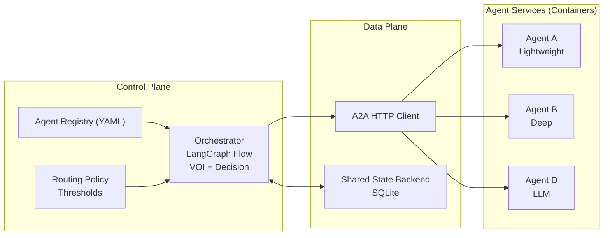

# Bayesian Agent Orchestrator for Network Intrusion Detection Systems

---

# Introduction

- **The Context:** Modern Network Intrusion Detection Systems (NIDS) utilize heterogeneous detectors (ML classifiers, heuristic filters, anomaly detectors) but suffer from high false-positive rates and "alert fatigue".
- **The Flaw:** Current systems naively aggregate outputs using fixed thresholds or rigid cascades, ignoring asymmetric costs (e.g., missed attacks vs. wasted analyst time) and failing to quantify true epistemic uncertainty.
- **The Solution:** The Bayesian Agent Orchestrator (BAO) fuses detector alerts probabilistically, maintains a posterior belief over the hidden threat state, and makes cost-sensitive decisions (alert, defer, or acquire more evidence) using a Value of Information (VOI) criterion.

--- 
# Problem Statements
- **Lack of Orchestration:** Current LLM-based agents and NIDS rely on single models or heuristic workflows that fail to handle task-level epistemic uncertainty coherently, leading to brittle performance as decision horizons lengthen.
- **Value of Information:** Standard agents use fixed confidence thresholds that ignore cost asymmetries (e.g., missing an attack vs. triggering a false alarm). They cannot perform principled sequential belief updates, causing over- or under-querying of tools.
- **Human Collaboration:** Full automation produces overconfident, unauditable decisions. Without a mechanism to calculate uncertainty, systems lack a principled way to route high-stakes/low-confidence cases to human analysts or learn from their feedback.

---

# Objectives
- **Orchestration Layer:** Implement a Bayesian control layer that treats LLMs and tools as black-box observation sources. It will maintain explicit belief states to drive routing, stopping, and budgeting decisions. 
- **Value of Information (VOI):** Embed Bayesian decision theory to drive act-vs-gather decisions. Trigger additional evidence collection (e.g., running an expensive detector) *only* when the expected reduction in decision loss exceeds the acquisition cost.
- **Human Collaboration:** Design uncertainty-driven deferral mechanisms. Calibrated posteriors and utility parameters will route ambiguous, high-entropy alerts to humans, integrating analyst responses back into the belief update loop to reduce workload and improve detection robustness.

---

# Literature Review
- **Agent Orchestration:** Frameworks like the *Model-Control-Policy* (Suggu) dictate the need for a governance layer, while hierarchical multi-agent systems (Alba Torres) validate distributed defense architectures. However, they lack mathematical optimization engines.
- **Bayesian Decision Theory & VOI:** Papamarkou et al. assert agentic AI must make "Bayes-consistent" decisions using a central belief state. Kim et al. successfully applied VOI to alert triage, reducing detection time by 79%, proving the superiority of probabilistic prioritization. 
- **Human-AI Collaboration:** Tilbury warns of "alert fatigue" without intelligent filtering. De Nascimento operationalized this by routing high-entropy (uncertain) predictions to analysts, keeping workloads manageable.
- **The Gap:** No unified framework orchestrates diverse detectors with a central belief state while using VOI to dynamically trigger expensive agents or human analysts.

---

# Research Methods: High-Level Architecture

---

# Research Methods: Bayesian Orchestrator Logic

- **Separating Prediction from Decision:** The BAO treats LLMs and detectors strictly as black-box "evidence generators", centralizing the belief state entirely within the orchestration layer.
- **Generative Likelihood Elicitation (Amin):** Instead of asking an LLM for a discriminative classification ($p(state|evidence)$), the orchestrator uses contrastive prompting to elicit generative likelihoods: *"Assume this traffic is malicious; how typical is this observation?"* ($p(evidence|state)$). 
- **Mathematical Belief Updating:** Using these extracted likelihoods and an explicit prior, the orchestrator updates its posterior belief via Bayes' rule mathematically.
- **VOI & Expected Utility:** The orchestrator evaluates the posterior against an explicit cost matrix. It calculates the Value of Information (VOI) to decide if querying another agent or pausing for human-in-the-loop (HITL) review will reduce expected costs enough to justify the effort.
